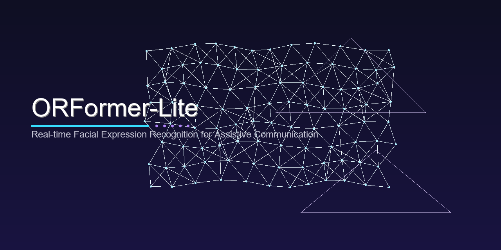

<p align="center">
  
</p>

# ORFormer-Lite

Real-time facial expression recognition for assistive communication. Detects expressions via 478-point face landmarks (MediaPipe) and maps them to communication intents (YES/NO/HELP/PAIN) for users with motor disabilities.

## Setup

```bash
pip install -r requirements.txt
```

## Usage

```bash
# Capture training data from webcam
py main.py train --mode capture --samples 50

# Train on captured data
py main.py train --mode train

# Run webcam demo
py main.py demo

# Run GUI
py main.py gui

# Start API server
py main.py server
```

## Expression Mapping

| Expression | Intent |
|------------|--------|
| Happy | YES |
| Sad | NO |
| Surprised | HELP |
| Angry | PAIN |
